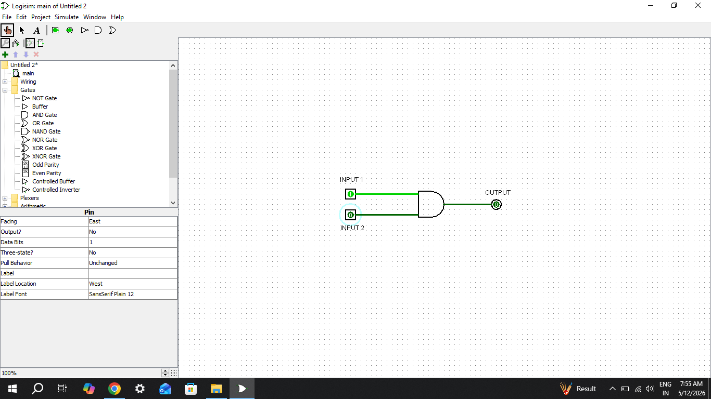
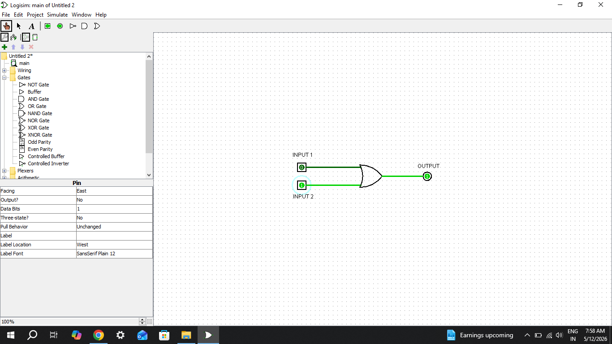
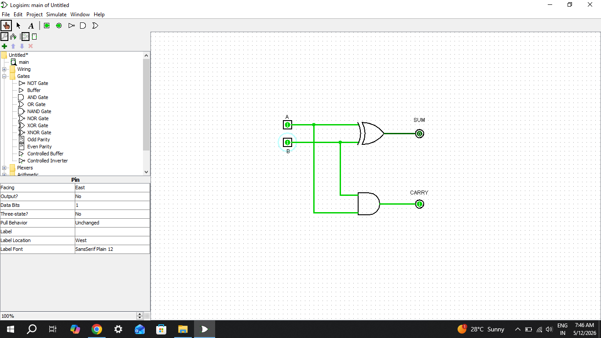

# VLSI Internship Task 1

## Objective
This project demonstrates implementation and simulation of basic logic gates and Half Adder using Logisim Evolution.

## Tools Used
- Logisim Evolution
- GitHub

## Implemented Logic Gates
- AND Gate
- OR Gate
- NOT Gate
- NAND Gate
- NOR Gate
- XOR Gate

## Combinational Circuit
- Half Adder

## Files Included
- task1_report.pdf
- basic_logic_gates.circ
- Logic gate screenshots
- Half Adder screenshot

## Truth Tables
All truth tables are included in the PDF report.
## AND Gate Truth Table

| A | B | Output |
|---|---|---|
| 0 | 0 | 0 |
| 0 | 1 | 0 |
| 1 | 0 | 0 |
| 1 | 1 | 1 |
## OR Gate Truth Table

| A | B | Output |
|---|---|---|
| 0 | 0 | 0 |
| 0 | 1 | 1 |
| 1 | 0 | 1 |
| 1 | 1 | 1 |
## NOT Gate Truth Table

| A | Output |
|---|---|
| 0 | 1 |
| 1 | 0 |
## XOR Gate Truth Table

| A | B | Output |
|---|---|---|
| 0 | 0 | 0 |
| 0 | 1 | 1 |
| 1 | 0 | 1 |
| 1 | 1 | 0 |
## Half Adder Truth Table

| A | B | Sum | Carry |
|---|---|---|---|
| 0 | 0 | 0 | 0 |
| 0 | 1 | 1 | 0 |
| 1 | 0 | 1 | 0 |
| 1 | 1 | 0 | 1 |
## Screenshots

### AND Gate

### OR Gate

### Half Adder

## Author
Aparna Marisetty
